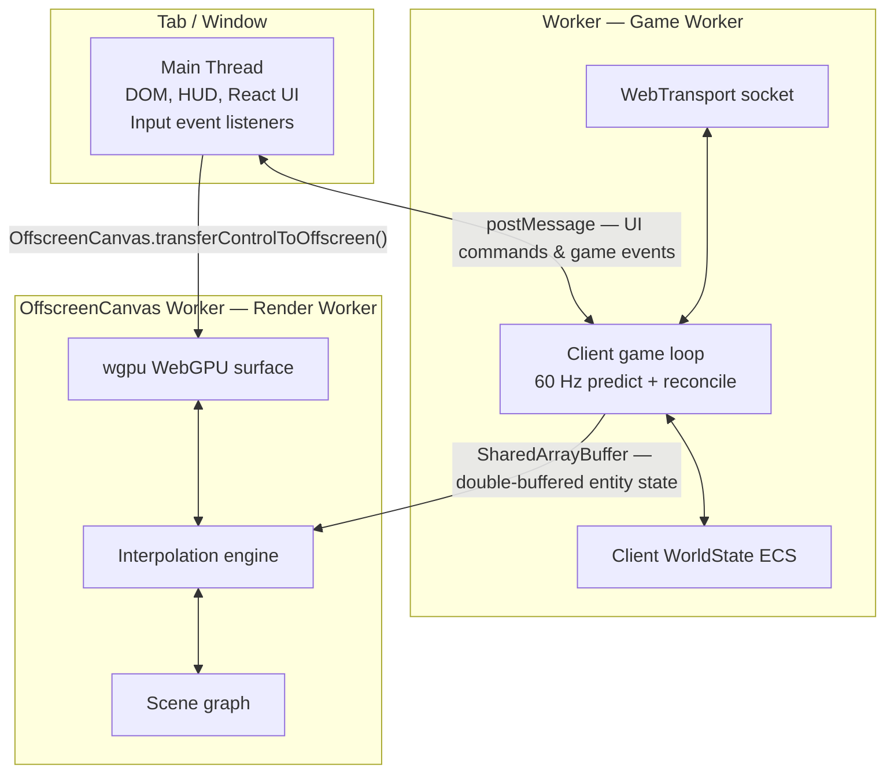
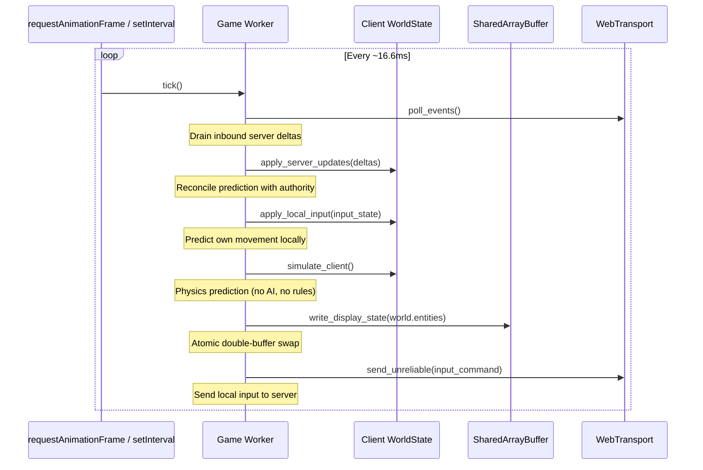
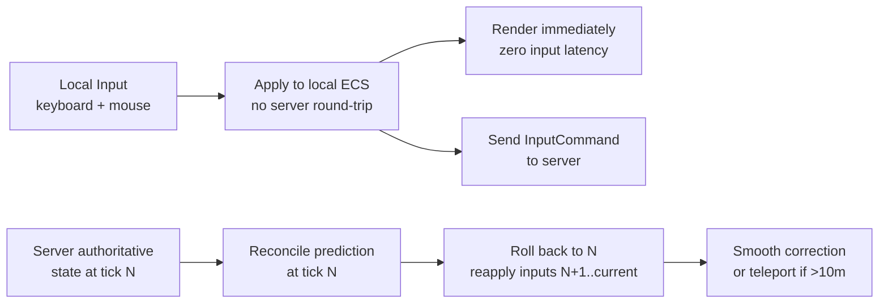
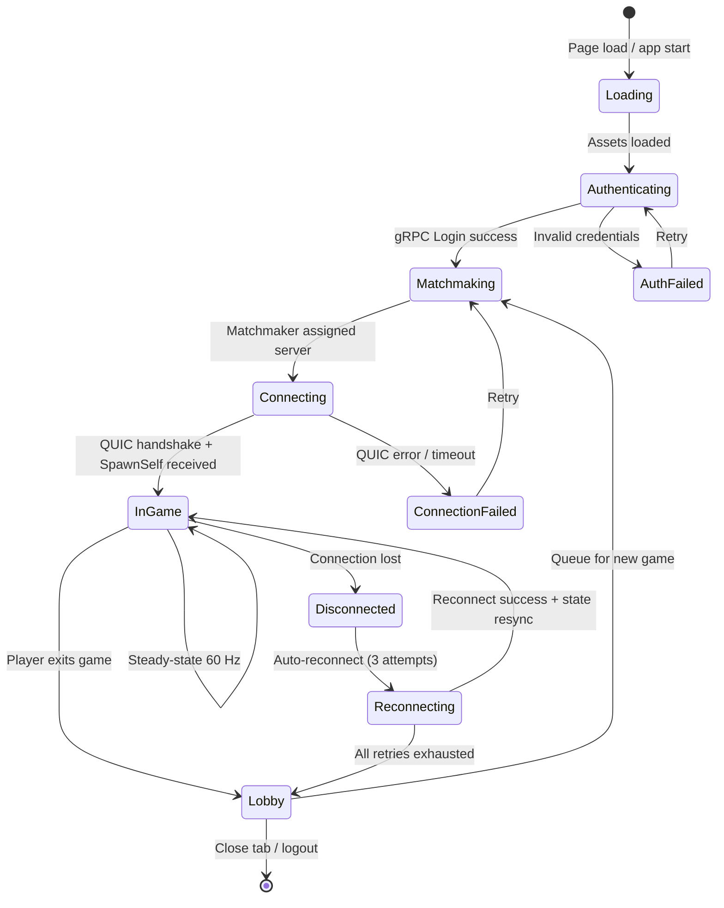

# Aetheris Engine — Client Architecture & Design Document

## Table of Contents

1. [Executive Summary](#executive-summary)
2. [Multi-Worker Topology](#2-multi-worker-topology)
3. [Game Worker — Simulation & Networking](#3-game-worker--simulation--networking)
4. [Render Worker — GPU Pipeline](#4-render-worker--gpu-pipeline)
5. [Main Thread — DOM & HUD](#5-main-thread--dom--hud)
6. [SharedArrayBuffer — Zero-Copy State Bridge](#6-sharedarraybuffer--zero-copy-state-bridge)
7. [Client-Side Prediction & Interpolation](#7-client-side-prediction--interpolation)
8. [Client State Machine](#8-client-state-machine)
9. [gRPC Control Plane (Browser)](#9-grpc-control-plane-browser)
10. [Native Client Architecture](#10-native-client-architecture)
11. [WASM Build Pipeline](#11-wasm-build-pipeline)
12. [Crate Structure & Module Layout](#12-crate-structure--module-layout)
13. [Performance Contracts](#13-performance-contracts)
14. [Open Questions](#14-open-questions)
15. [Appendix A — Glossary](#appendix-a--glossary)
16. [Appendix B — Decision Log](#appendix-b--decision-log)

---

## Executive Summary

The Aetheris Client is a high-performance, multi-threaded application designed to run natively inside modern web browsers via WebAssembly. Its architecture is governed by one constraint: **the render loop must never be blocked by the network, the simulation, or DOM layout**.

This requirement drives the entire design: a three-worker topology where simulation, rendering, and the DOM are isolated on separate threads, communicating through `SharedArrayBuffer` for zero-copy state transfer.

The client adheres to the **Asymmetric Simulation** principle:

- The **server** is the sole authority on game state.
- The **client** predicts its own input locally but always reconciles with server corrections.
- The **render thread** interpolates between the two most recent authoritative snapshots, ensuring smooth 60+ FPS rendering at 60 Hz server tick rates even under network jitter.

### Client Variants

| Variant | Target | Crate | Purpose |
|---|---|---|---|
| **Browser WASM** | `wasm32-unknown-unknown` | `aetheris-client-wasm` | Primary user-facing client |
| **Native** | `x86_64-unknown-linux-gnu` | `aetheris-client-native` | Development, headless testing |
| **Stress Bot** | `x86_64` | `aetheris-smoke-test` | Load testing (500–5000 simultaneous bots) |

---

## 2. Multi-Worker Topology

The browser client uses three isolated JS execution contexts, each running a WASM module:



**Why three workers?**

1. **Main Thread isolation.** The DOM layout engine runs on the main thread. If the game loop or GPU submission ever blocks the main thread, the browser marks the tab as "frozen" and input events queue up. With three workers, DOM layout and HUD React rerenders never compete with game logic.

2. **Game Worker independence.** The 60 Hz game loop must not be interrupted by garbage collection, font rendering, or any DOM operation. A dedicated `Worker` provides a clean execution context with its own GC heap, separate from the main thread. A regular `Worker` (not `Worker`) is used so that each browser tab has its own isolated game state — one tab cannot accidentally observe or affect another.

3. **Render Worker with OffscreenCanvas.** WebGPU (`wgpu`) requires a GPU surface. `OffscreenCanvas` transfers surface ownership to the Render Worker, meaning GPU command encoding and submission happen entirely off the main thread. Frame drops caused by a slow GPU never affect input latency.

---

## 3. Game Worker — Simulation & Networking

### 3.1 Responsibilities

The Game Worker owns:

- The `WebTransport` socket to the server Data Plane (impl `GameTransport`).
- The client-side `WorldState` ECS (entity positions, health, etc.).
- The input prediction loop (local player movement applied immediately).
- The server reconciliation logic (applying authoritative corrections from the server).
- The `SharedArrayBuffer` producer (writes stable entity positions for the Render Worker).

See [PROTOCOL_DESIGN.md](https://github.com/garnizeh-labs/aetheris-protocol/blob/main/docs/PROTOCOL_DESIGN.md) for the canonical trait definitions of `GameTransport`, `WorldState`, and `Encoder`.

### 3.2 Client Game Loop (60 Hz)



### 3.3 Input Command Pipeline

```rust
/// A single tick's input from the local player.
/// Sent to the server as an unreliable datagram every tick.
#[derive(Debug, Clone, Serialize, Deserialize)]
pub struct InputCommand {
    /// The client tick this input was generated at. Used for lag compensation.
    pub client_tick: u64,
    /// Movement direction (unit vector, client-frame coordinates).
    pub move_dir: Vec2,
    /// Bitmask of active buttons/actions (e.g., bit 0=Secondary, 1=Primary, 2=Interact).
    pub actions: u32,
    /// Camera look direction (yaw, pitch in radians).
    pub look_dir: Vec2,
}
```

The server applies the `InputCommand` in Stage 2 (`apply_updates`), uses it to drive the entity's physics in Stage 3 (`simulate`), and broadcasts the authoritative result back to the client in Stage 5. The client reconciles the difference between its prediction and the authority in the next tick.

> **Canonical Source:** See [INPUT_PIPELINE_DESIGN.md](INPUT_PIPELINE_DESIGN.md) for the extensible `InputSchema` trait that generalizes `InputCommand` to support non-game input types (text edits, trade orders, etc.).

### 3.4 Priority Channel Tagging (Client-Side)

The Game Worker tags every outbound message with a **1-byte Priority Channel header** before transmission. This enables the server's `IngestPriorityRouter` (Stage 1) to sort inbound messages by priority — combat inputs are processed before chat under server load.

The client receives the `ChannelRegistry` configuration from the server during the connection handshake (the same channel layout used server-side). Outbound tagging:

- **`InputCommand`** (movement) → tagged as channel `"self"` (P0)
- **Combat actions** (fire, ability) → tagged as channel `"combat"` (P1)
- **Chat messages** → tagged as channel `"cosmetic"` (P5)

Inbound server→client messages are also channel-tagged; the Game Worker can process high-priority updates (own ship state, combat events) before low-priority ones (distant entities, cosmetic effects) if the tick budget is tight.

See [PRIORITY_CHANNELS_DESIGN.md §8](https://github.com/garnizeh-labs/aetheris-engine/blob/main/docs/PRIORITY_CHANNELS_DESIGN.md#8-bidirectional-priority-processing) for the full bidirectional priority model.

### 3.5 Input History Buffer

The client maintains a ring buffer of the last 128 input commands. On receiving a server correction for tick N, it:

1. Rolls back local state to the server's authoritative snapshot at tick N.
2. Re-applies inputs N+1 through `current_tick` from the history buffer.
3. Computes the divergence: `|predicted_pos - corrected_pos|`.
4. If divergence > 0.5 m: applies a smooth correction lerp over 5 frames (avoids snap).
5. If divergence > 10 m: teleports (the client was clearly wrong).

> **Canonical Source:** See [INPUT_PIPELINE_DESIGN.md](INPUT_PIPELINE_DESIGN.md) §7–8 for the generic `PredictableInput` trait and `InputHistoryBuffer<I>` that generalize this reconciliation pattern to any input schema.

---

## 4. Render Worker — GPU Pipeline

### 4.1 Responsibilities

The Render Worker owns:

- The `wgpu` device and surface (backed by WebGPU in browser, Vulkan/Metal/DX12 natively).
- The interpolation engine: reads double-buffered entity state from `SharedArrayBuffer`.
- The scene graph: meshes, materials, lights.
- Frame submission at the display refresh rate (up to 144 Hz).

### 4.2 Rendering Pipeline

```mermaid
graph LR
    subgraph "Render Worker (runs at display Hz)"
        SAB[SharedArrayBuffer\nread entity positions]
        INTERP[Interpolation Engine\nalpha = frac(display_time / tick_interval)]
        SCENE[Scene Graph\nupdate transform matrices]
        WG[wgpu Command Encoder\nbuild draw calls]
        SURF[wgpu Surface\npresent frame]

        SAB --> INTERP
        INTERP --> SCENE
        SCENE --> WG
        WG --> SURF
    end
```

### 4.3 Two-State Interpolation

The render loop operates at the display refresh rate (60–144+ Hz), which is higher than or equal to the server tick rate (60 Hz). To produce sub-tick intermediate frames, the Render Worker interpolates between the two most recently received server snapshots:

```rust
/// Computes the interpolated position for rendering.
///
/// `alpha` is the fractional progress between tick[n] and tick[n+1].
///   alpha = (display_time - snapshot_time[n]) / tick_interval
///   alpha ∈ [0.0, 1.0]
///
/// At 60 Hz display and 60 Hz server: alpha cycles 0→1 per frame.
/// At 144 Hz display and 60 Hz server: alpha takes ~2.4 sub-steps per tick.
pub fn interpolate_position(prev: Vec3, next: Vec3, alpha: f32) -> Vec3 {
    prev.lerp(next, alpha.clamp(0.0, 1.0))
}
```

### 4.4 Interpolation Delay Buffer

The client introduces an intentional **100 ms interpolation delay**. Rather than rendering the most recent server tick (which may arrive 20–150 ms ago), it renders the state from 100 ms ago, ensuring it always has at least 6 ticks of buffer to interpolate through:

```
Timeline:
  Server sends tick N at t=0ms
  Client receives tick N at t=50ms  (50ms RTT/2)
  Client interpolation target: t - 100ms = t=50ms - 100ms = t=-50ms
  → Client renders the state from 50ms before the current server tick
  → Buffer contains 100ms / 16.6ms ≈ 6 ticks of ahead data
  → Even if 3 consecutive ticks are dropped, rendering never freezes
```

This is the standard technique used by Source Engine, Minecraft, and Valorant.

---

## 5. Main Thread — DOM & HUD

### 5.1 Responsibilities

The main thread:

- Hosts the HTML5 `<canvas>` element (ownership transferred to the Render Worker).
- Renders the HUD overlays: health bars, minimap, chat, inventory UI (React/Preact).
- Captures keyboard and mouse events, forwarding them to the Game Worker via `postMessage`.
- Receives game events (death, level-up, etc.) from the Game Worker for UI notifications.

### 5.2 Input Forwarding

```typescript
// main.ts — runs on the main thread
// Note: uses Worker (not SharedWorker) so each tab owns independent game state.
const gameWorker = new Worker(new URL('./game.worker.ts', import.meta.url), { type: 'module' });

document.addEventListener('keydown', (e) => {
    gameWorker.postMessage({ type: 'key_down', key: e.code });
});

document.addEventListener('mousemove', (e) => {
    gameWorker.postMessage({
        type: 'mouse_move',
        dx: e.movementX,
        dy: e.movementY,
    });
});
```

`postMessage` is the only communication channel from the main thread to the Game Worker. It is asynchronous and non-blocking — the main thread never waits for the Game Worker.

---

## 6. SharedArrayBuffer — Zero-Copy State Bridge

> **Canonical Source:** See [WORKER_COMMUNICATION_DESIGN.md](WORKER_COMMUNICATION_DESIGN.md) for the full SAB memory layout, double-buffer flip-bit protocol, postMessage envelope specification, extensible region model (Extended Platform), and cross-origin isolation security requirements.

### 6.1 Design

The Game Worker writes entity render state into a `SharedArrayBuffer` every tick. The Render Worker reads from it every frame. No `postMessage` serialization occurs — both workers access the same memory region simultaneously.

To prevent the Render Worker from reading a partially-written entity state, the buffer uses a **double-buffering scheme** with an `Atomics.store()`-based flip bit:

```
SharedArrayBuffer layout:
  [0..3]   Atomic<u32>  → active_buffer index (0 or 1)
  [4..7]   Atomic<u32>  → entity_count in active buffer
  [8..N]   Buffer A     → EntityDisplayState[MAX_ENTITIES]
  [N..2N]  Buffer B     → EntityDisplayState[MAX_ENTITIES]
```

```rust
/// Written by the Game Worker every tick.
/// Read by the Render Worker every frame.
/// Must be repr(C) + Pod for cross-worker SharedArrayBuffer access.
#[repr(C)]
#[derive(Clone, Copy, bytemuck::Pod, bytemuck::Zeroable)]
pub struct EntityDisplayState {
    pub network_id: u64,
    pub position: [f32; 3],     // world-space position
    pub velocity: [f32; 3],     // for client-side extrapolation
    pub rotation: [f32; 4],     // quaternion (w, x, y, z)
    pub health_normalized: f32, // 0.0–1.0
    pub animation_id: u32,
    pub flags: u32,             // alive, visible, local_player, etc.
}
```

### 6.2 Atomic Double-Buffer Swap

```rust
// Game Worker — after writing all entities into Buffer B:
// 1. Write all data into the inactive buffer.
for (i, entity) in world.entities().enumerate() {
    write_entity_to_sab(inactive_buffer_ptr, i, entity);
}
// 2. Atomically swap active buffer (Relaxed + Release fence).
Atomics::store(&flip_bit, inactive_index, Ordering::Release);
```

```rust
// Render Worker — reading state for interpolation:
// 1. Load the current active buffer index (Acquire fence).
let buf_index = Atomics::load(&flip_bit, Ordering::Acquire);
let count = Atomics::load(&entity_count, Ordering::Acquire);
// 2. Read from the active buffer (guaranteed stable snapshot).
let entities = read_entities_from_sab(buf_index, count);
```

---

## 7. Client-Side Prediction & Interpolation

### 7.1 Prediction Flow



### 7.2 Reconciliation Invariants

```
R1 — Prediction is applied before sending: The client applies input locally
     on the same tick it sends the command to the server. Display is
     always ahead of the server by ~RTT/2.

R2 — The server is always authoritative: When the server's correction
     arrives, local state is rolled back to the server's version.
     The client NEVER "wins" a disagreement with the server.

R3 — Corrections are smoothed: A divergence < 0.5m is lerp'd over 5 frames
     to prevent visual snapping. A divergence > 10m is a teleport (hardshell).

R4 — Input history is bounded: The ring buffer holds max 128 ticks (~2.1s).
     If a server correction arrives for a tick older than the buffer,
     the client requests a full resync (RequestFullSnapshot).
```

### 7.3 Extrapolation on Packet Loss

If the last received server snapshot is more than 3 ticks old (50 ms), the client switches from interpolation to extrapolation for **other entities** (not the local player):

```rust
fn get_render_position(entity: &EntityDisplayState, ticks_since_update: u32) -> Vec3 {
    let pos = Vec3::from(entity.position);
    if ticks_since_update == 0 {
        return pos;
    }
    if ticks_since_update <= 3 {
        // Extrapolate using last known velocity
        let vel = Vec3::from(entity.velocity);
        let dt = ticks_since_update as f32 * TICK_INTERVAL_SECS;
        pos + vel * dt
    } else {
        // Snap/Freeze to last known position to prevent wild extrapolation
        pos
    }
}
```

After 6 ticks (100 ms) without an update for a specific entity, the entity's position is frozen to prevent wild extrapolation errors.

---

## 8. Client State Machine



---

## 9. gRPC Control Plane (Browser)

The WASM client connects to the gRPC Control Plane via **gRPC-Web** (HTTP/1.1 or HTTP/2 over TCP). This is the only place where TCP is used — the Data Plane is 100% QUIC.

```rust
// Browser WASM: uses tonic-web-wasm-client (no native TLS imports)
use tonic_web_wasm_client::Client as WasmGrpcClient;
use crate::auth_proto::auth_service_client::AuthServiceClient;

pub async fn login(
    endpoint: &str,
    username: &str,
    password_hash: &[u8],
) -> Result<SessionToken, AuthError> {
    let wasm_client = WasmGrpcClient::new(endpoint.to_string());
    let mut client = AuthServiceClient::new(wasm_client);
    let response = client.login(LoginRequest {
        username: username.to_string(),
        password_hash: password_hash.to_vec(),
    }).await?;
    Ok(response.into_inner().token.unwrap())
}
```

The `tonic-web-wasm-client` crate provides a Tonic transport layer that translates gRPC calls to `fetch()` HTTP requests — the only network API available on the main JS thread in a WASM context.

---

## 10. Native Client Architecture

> **Implementation status:** `aetheris-client-native` is currently a stub — it contains only
> a `main.rs` with placeholder output. The table below is a design target for P2/P3, not a
> description of existing functionality.

The native client (`aetheris-client-native`) targets desktop development and headless stress testing. It does not use Web Workers or `SharedArrayBuffer`. Instead:

- **Single Tokio runtime** with `tokio::spawn` tasks replacing Web Workers.
- **`quinn` directly** for transport (same `GameTransport` trait).
- **`wgpu` with Vulkan/Metal/DirectX12 backend** for rendering (same render pipeline).
- **No WebGPU limitations**: can use compute shaders, storage buffers, multisampling.

Key differences from the WASM client:

| Feature | Browser WASM | Native |
|---|---|---|
| Threading | Worker + OffscreenCanvas (Local Worker) | Tokio tasks + std threads |
| Transport | WebTransport (wtransport) | quinn |
| Rendering | wgpu WebGPU backend | wgpu Vulkan/Metal/DX12 |
| Auth | gRPC-Web (fetch) | gRPC (tonic native) |
| Input | KeyboardEvent + Mouse lock API | winit (cross-platform input) |
| Window | Browser tab canvas | winit window |

---

## 11. WASM Build Pipeline

### 11.1 Prerequisites

```bash
# Install the WASM target
rustup target add wasm32-unknown-unknown

# Install wasm-pack for optimized WASM + JS glue generation
cargo install wasm-pack

# Install wasm-opt for binary size optimization
# (included in wasm-pack, or install binaryen separately)
```

### 11.2 Build Commands

```bash
# Development build (no optimization, includes debug info)
wasm-pack build --target web --dev crates/aetheris-client-wasm

# Release build (wasm-opt -Oz, ~1.2MB target)
wasm-pack build --target web --release crates/aetheris-client-wasm

# Output: pkg/
#   aetheris_client_wasm_bg.wasm  (~1.2MB compressed)
#   aetheris_client_wasm.js       (JS shim + bindgen glue)
#   aetheris_client_wasm.d.ts     (TypeScript types)
```

### 11.3 Cargo Profile for WASM

```toml
# Cargo.toml workspace [profile.release]
[profile.release]
opt-level = 'z'    # Minimize binary size over speed
lto = true         # Link-time optimization (essential for WASM)
strip = "symbols"  # Remove debug symbols (~50KB saving)
panic = "abort"    # Remove panic unwinder (~50KB saving)
codegen-units = 1  # Better LTO at cost of compile time
```

### 11.4 Binary Size Budget

| Component | Compressed Size | Uncompressed |
|---|---|---|
| WASM core (game + ECS + encoder) | ~800 KB | ~1.8 MB |
| wgpu WebGPU backend | ~250 KB | ~600 KB |
| Transport layer | ~100 KB | ~250 KB |
| gRPC/Protobuf runtime | ~50 KB | ~120 KB |
| **Total target** | **≤ 1.2 MB** | **≤ 2.8 MB** |

Sizes are measured post `wasm-opt -Oz` and gzip compression. The `< 2 MB uncompressed` target ensures fast first-load on mobile networks.

### 11.5 `SharedArrayBuffer` Browser Requirements

`SharedArrayBuffer` requires **cross-origin isolation** headers to be set by the server:

```nginx
# Required HTTP headers for WASM SharedArrayBuffer support
add_header Cross-Origin-Embedder-Policy require-corp;
add_header Cross-Origin-Opener-Policy same-origin;
```

Without these headers, `SharedArrayBuffer` is disabled in all browsers since the Spectre vulnerability mitigations. The Vite dev server (`playground/vite.config.ts`) sets these headers automatically for local development.

---

## 12. Crate Structure & Module Layout

```
crates/
└── aetheris-client-wasm/
    ├── Cargo.toml              # target: wasm32-unknown-unknown
    ├── build.rs                # Protobuf codegen for auth.proto
    └── src/
        ├── lib.rs              # Entry point, worker ID, performance_now()
        ├── auth.rs             # gRPC-Web login + SessionToken management
        ├── transport.rs        # WebTransport socket (wasm32 only)
        ├── world_state.rs      # Client-side WorldState: prediction + reconcile
        ├── shared_world.rs     # SharedArrayBuffer double-buffer writer
        ├── render.rs           # wgpu WebGPU render loop (wasm32 only)
        └── shaders/
            ├── entity.wgsl     # Entity mesh vertex + fragment shader
            └── hud.wgsl        # HUD overlay shader

playground/                     # TypeScript/Vite — official engine playground
├── index.html
├── package.json
├── vite.config.ts
├── tsconfig.json
└── src/
    ├── main.ts                 # Main thread: DOM, input forwarding, HUD
    ├── game.worker.ts          # Game Worker shell: loads WASM, runs tick loop
    ├── render.worker.ts        # Render Worker shell: loads WASM, runs render loop
    └── env.d.ts                # TypeScript environment declarations
```

---

## 13. Performance Contracts

| Metric | Budget | How Measured |
|---|---|---|
| Render loop: frame time | ≤ 16.6 ms (60 FPS) | Browser DevTools, `performance.measure()` |
| Game Worker: tick time | ≤ 16.6 ms | `performance.now()` histogram |
| Input → visual latency | ≤ 33 ms (2 frames) | Manual test + frame delay analysis |
| Interpolation delay | 100 ms (fixed) | Config constant |
| WASM binary size (compressed) | ≤ 1.2 MB | `wasm-pack build --release + du -sh` |
| Reconnect time (after drop) | ≤ 3 retries in 9s | Integration test |
| Full snapshot resync | ≤ 500 ms | Integration test |
| entity_count in SAB | ≤ 2,500 | Config constant `MAX_ENTITIES_SAB` |

### 13.1 Telemetry (Client-Side)

The WASM client emits performance marks to the browser's DevTools timeline:

```typescript
// In game.worker.ts
performance.mark('tick_start');
// ... tick work ...
performance.mark('tick_end');
performance.measure('tick_duration', 'tick_start', 'tick_end');
```

For production diagnostics, the client posts tick timing metrics to the server's `/telemetry/ingest` endpoint (sampled at 1% rate to avoid overhead): p50, p95, p99 frame time; prediction divergence distribution; packet loss estimate.

---

## 14. Open Questions

| Question | Context | Impact |
|---|---|---|
| **PWA Offline Support** | Should we allow clients to run "practice mode" locally using a local ECS? | Data persistence and local logic safety. |
| **Asset Compression** | Which format (KTX2, Basis Universal) is best for WASM decoding speed? | Texturing and VRAM usage. |
| **Mobile Gestures** | How to map 6DOF movement to touch input in the HUD? | Accessibility and control complexity. |

---

## Appendix A — Glossary

### Mini-Glossary (Quick Reference)

- **WASM (WebAssembly)**: The binary instruction format enabling near-native speed in browsers.
- **OffscreenCanvas**: An API that decouples canvas rendering from the main browser thread.
- **SharedArrayBuffer**: A memory region shared between Web Workers for zero-copy data transfer.
- **Lerp (Linear Interpolation)**: Smoothly transitioning between two positions based on a fractional progress bit.
- **Reconciliation**: The process of correcting local client state to match authoritative server state.

[Full Glossary Document](https://github.com/garnize/aetheris/blob/main/docs/GLOSSARY.md)

---

## Appendix B — Decision Log

| # | Decision | Rationale | Revisit If... | Date |
|---|---|---|---|---|
| D1 | Three-worker topology | Isolates simulation and DOM from the render loop, ensuring 60+ FPS regardless of UI load. | Browser multi-threading overhead becomes a bottleneck. | 2026-04-15 |
| D2 | SharedArrayBuffer for state bridge | Enables zero-copy, low-latency transfer between workers. | Security changes in browsers disable SAB permanently. | 2026-04-15 |
| D3 | OffscreenCanvas for GPU | Decouples render submission from the main thread layout. | Major browsers drop support for OffscreenCanvas. | 2026-04-15 |
| D4 | 100ms interpolation delay | Absorbs network jitter, ensuring smooth visuals on erratic links. | Average Internet latency drops below 20ms globally. | 2026-04-15 |
| D5 | wgpu for rendering | Unified Rust codebase for both WebGPU and native backends (Vulkan/Metal/DX12). | A more performant web-native rendering library emerges. | 2026-04-15 |
| D6 | Client-side Priority Channel tagging | Enables server-side inbound priority processing (`IngestPriorityRouter`). The client receives the `ChannelRegistry` from the server at handshake. See [PRIORITY_CHANNELS_DESIGN.md §8](https://github.com/garnizeh-labs/aetheris-engine/blob/main/docs/PRIORITY_CHANNELS_DESIGN.md#8-bidirectional-priority-processing). | If 1-byte channel overhead per datagram measurably impacts bandwidth. | 2026-04-15 |
