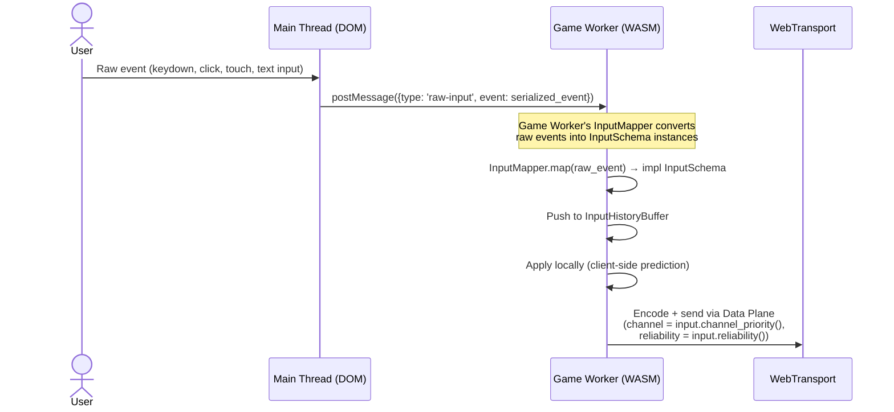

---Version: 0.1.0-draft
Status: Phase 1 — MVP / Phase 3 — Extensible
Phase: P1 | P3
Last Updated: 2026-04-16
Authors: Team (Antigravity)
Spec References: [ENGINE_DESIGN, PROTOCOL_DESIGN, CLIENT_DESIGN, SECURITY_DESIGN, INTEGRATION_DESIGN, NEXUS_PLATFORM_DESIGN]
Tier: 3
---

# Aetheris Engine — Input Pipeline Design Document

## Executive Summary

The Input Pipeline defines **how client actions travel from a keyboard/mouse/touch event to a validated state mutation in the server ECS**. In the current P1 implementation, input is modelled as a single concrete struct (`InputCommand`) tailored to Void Rush's space shooter mechanics: movement direction, jump, action button, look direction.

This design is insufficient for a platform that must support:

- **Text editing** — character insertions, deletions, cursor movements, selections.
- **Trade orders** — ticker ID, side (buy/sell), amount, order type.
- **Quiz answers** — question index, answer selection.
- **Whiteboard drawing** — polyline points, colour, brush width.

This document introduces the **`InputSchema` trait** — an abstraction that lets each application define its own input types while reusing the engine's input pipeline infrastructure: encoding, transport, validation, prediction, reconciliation, and history buffering.

### Design Principle

> **The engine owns the pipeline. The application owns the schema.**

The engine defines *how* input flows (encode → transport → validate → apply). The application defines *what* input contains (fields, types, constraints). The two are decoupled through the `InputSchema` trait, following the same Trait Facade pattern as `GameTransport`, `WorldState`, and `Encoder`.

## Table of Contents

1. [Executive Summary](#1-executive-summary)
2. [Motivation — Beyond InputCommand](#2-motivation--beyond-inputcommand)
3. [Architecture — The Input Schema Trait](#3-architecture--the-input-schema-trait)
4. [Client-Side Input Flow](#4-client-side-input-flow)
5. [Server-Side Input Processing](#5-server-side-input-processing)
6. [Input Validation & Security](#6-input-validation--security)
7. [Client-Side Prediction & Reconciliation](#7-client-side-prediction--reconciliation)
8. [Input History Buffer](#8-input-history-buffer)
9. [Phase Evolution](#9-phase-evolution)
10. [Open Questions](#10-open-questions)
11. [Appendix A — Glossary](#appendix-a--glossary)
12. [Appendix B — Decision Log](#appendix-b--decision-log)

---

## 1. Executive Summary

The Input Pipeline defines **how client actions travel from a keyboard/mouse/touch event to a validated state mutation in the server ECS**. In the current P1 implementation, input is modelled as a single concrete struct (`InputCommand`) tailored to Void Rush's space shooter mechanics: movement direction, jump, action button, look direction.

This design is insufficient for a platform that must support:

- **Text editing** — character insertions, deletions, cursor movements, selections.
- **Trade orders** — ticker ID, side (buy/sell), amount, order type.
- **Quiz answers** — question index, answer selection.
- **Whiteboard drawing** — polyline points, colour, brush width.

This document introduces the **`InputSchema` trait** — an abstraction that lets each application define its own input types while reusing the engine's input pipeline infrastructure: encoding, transport, validation, prediction, reconciliation, and history buffering.

### Design Principle

> **The engine owns the pipeline. The application owns the schema.**

The engine defines *how* input flows (encode → transport → validate → apply). The application defines *what* input contains (fields, types, constraints). The two are decoupled through the `InputSchema` trait, following the same Trait Facade pattern as `GameTransport`, `WorldState`, and `Encoder`.

---

## 2. Motivation — Beyond InputCommand

### 2.1 The Problem

The current `InputCommand` struct is hardcoded across multiple subsystems:

| Subsystem | Coupling |
|---|---|
| CLIENT_DESIGN §3.3 | `InputCommand` struct definition (move_dir, jump, action, look_dir) |
| CLIENT_DESIGN §3.5 | Input history buffer stores `InputCommand[128]` |
| CLIENT_DESIGN §5.2 | Main Thread → Game Worker postMessage carries keyboard/mouse events mapped to `InputCommand` fields |
| SECURITY_DESIGN §10 | Validation rules reference `InputCommand` fields directly |
| INTEGRATION_DESIGN §7 | Full sequence diagram uses `InputCommand` as the wire type |

Replacing or extending `InputCommand` requires modifying all of these. A Nexus application cannot add a `TextEdit` input type without forking the client pipeline.

### 2.2 The Solution

Replace the concrete `InputCommand` with a **trait + derive macro** pattern:

```
Before (P1 — hardcoded):
  InputCommand → Encoder → Transport → Validator → ECS

After (P3 — extensible):
  impl InputSchema for GameInput  → Encoder → Transport → Validator → ECS
  impl InputSchema for TextEdit   → Encoder → Transport → Validator → ECS
  impl InputSchema for TradeOrder → Encoder → Transport → Validator → ECS
```

The pipeline stages (`Encoder`, `Transport`, validation, history buffer) operate on `dyn InputSchema` or are monomorphized via generics. The concrete type is application-specific.

---

## 3. Architecture — The Input Schema Trait

### 3.1 Trait Definition

```rust
/// Trait for application-defined input types.
///
/// Every application defines one or more input schemas.
/// The engine's input pipeline operates generically over this trait.
///
/// # Requirements
/// - Must be serializable (for transport over Data Plane).
/// - Must be cloneable (for input history buffer / reconciliation).
/// - Must carry a `client_tick` for lag compensation.
/// - Must be validatable (server rejects invalid inputs).
///
/// # Phase Evolution
/// - **P1:** `InputCommand` implements this trait (backward-compatible).
/// - **P3:** Applications define custom schemas via `#[derive(InputSchema)]`.
pub trait InputSchema: Clone + Send + Sync + 'static {
    /// The client tick at which this input was generated.
    /// Used for lag compensation and reconciliation.
    fn client_tick(&self) -> u64;

    /// Validate this input against server-side constraints.
    /// Returns `Ok(())` if valid, or an error describing the violation.
    /// Called in Stage 2 (Apply) before the input affects the ECS.
    fn validate(&self, ctx: &InputValidationContext) -> Result<(), InputValidationError>;

    /// The Priority Channel this input should be sent on.
    /// Default: P0 (highest priority — inputs are critical).
    fn channel_priority(&self) -> u8 { 0 }

    /// The reliability tier for this input.
    /// Default: Volatile (most inputs are replaced by the next tick's input).
    fn reliability(&self) -> ReliabilityTier { ReliabilityTier::Volatile }

    /// Human-readable name for logging.
    fn schema_name(&self) -> &'static str;
}
```

### 3.2 P1 Backward Compatibility

The existing `InputCommand` implements `InputSchema` with zero changes to its fields:

```rust
const MAX_INSERT_LENGTH: usize = 10_000;

/// Void Rush — game-specific input schema.
/// This is the P1 InputCommand, now implementing the InputSchema trait.
#[derive(Debug, Clone, Serialize, Deserialize)]
pub struct GameInput {
    pub client_tick: u64,
    pub move_dir: Vec2,
    pub jump: bool,
    pub action: bool,
    pub look_dir: Vec2,
}

impl InputSchema for GameInput {
    fn client_tick(&self) -> u64 { self.client_tick }

    fn validate(&self, ctx: &InputValidationContext) -> Result<(), InputValidationError> {
        // Movement direction must be unit vector or zero
        if self.move_dir.length() > 1.01 {
            return Err(InputValidationError::InvalidMoveDirection);
        }
        // Look direction pitch must be within [-π/2, π/2]
        if self.look_dir.y.abs() > std::f32::consts::FRAC_PI_2 + 0.01 {
            return Err(InputValidationError::InvalidLookDirection);
        }
        // Action rate limiting
        if self.action && ctx.action_cooldown_remaining > 0 {
            return Err(InputValidationError::ActionOnCooldown {
                remaining: ctx.action_cooldown_remaining as u32,
            });
        }
        Ok(())
    }

    fn schema_name(&self) -> &'static str { "game-input" }
}
```

### 3.3 Nexus Input Schemas

```rust
/// Nexus — collaborative text editing input.
#[derive(Debug, Clone, Serialize, Deserialize)]
pub struct TextEditInput {
    pub client_tick: u64,
    pub document_id: NetworkId,
    pub operation: TextOperation,
}

#[derive(Debug, Clone, Serialize, Deserialize)]
pub enum TextOperation {
    Insert { line: u32, column: u32, text: String },
    Delete { line: u32, column: u32, length: u32 },
    CursorMove { line: u32, column: u32 },
    Select { start_line: u32, start_col: u32, end_line: u32, end_col: u32 },
}

impl InputSchema for TextEditInput {
    fn client_tick(&self) -> u64 { self.client_tick }

    fn validate(&self, ctx: &InputValidationContext) -> Result<(), InputValidationError> {
        // Document must exist and client must have edit perm {
                permission: "document:edit".to_string(),
                target: self.document_id,
            });
        }
        // Text insertion length limit (prevent DoS via massive pastes)
        if let TextOperation::Insert { ref text, .. } = self.operation {
            if text.len() > MAX_INSERT_LENGTH {
                return Err(InputValidationError::PayloadTooLarge {
                    size: text.len(),
                    max: MAX_INSERT_LENGTH,
                }ration {
            if text.len() > MAX_INSERT_LENGTH {
                return Err(InputValidationError::PayloadTooLarge);
            }
            // UTF-8 validity is guaranteed by Rust's String type
        }
        Ok(())
    }

    fn reliability(&self) -> ReliabilityTier {
        match self.operation {
            TextOperation::CursorMove { .. } => ReliabilityTier::Volatile,
            _ => ReliabilityTier::Ordered, // Edits must arrive in order
        }
    }

    fn schema_name(&self) -> &'static str { "text-edit" }
}

/// Nexus — trade/bet order input.
#[derive(Debug, Clone, Serialize, Deserialize)]
pub struct TradeOrderInput {
    pub client_tick: u64,
    pub ticker_id: NetworkId,
    pub side: OrderSide,
    pub amount_cents: u64,
    pub order_type: OrderType,
}

#[derive(Debug, Clone, Serialize, Deserialize)]
pub enum OrderSide { Buy, Sell }

#[derive(Debug, Clone, Serialize, Deserialize)]
pub enum OrderType { Market, Limit { price_cents: u64 } }

impl InputSchema for TradeOrderInput {
    fn client_tick(&self) -> u64 { self.client_tick }

    fn validate(&self, ctx: &InputValidationContext) -> Result<(), InputValidationError> {
        // Amount must be positive and within per-order limits
        if self.amount_cents == 0 || self.amount_cents > ctx.max_order_amount {
            return Err(InputValidationError::InvalidAmount);
        }
        // Client must have trading permission
        if !ctx.has_permission("trade:place", self.ticker_id) {
            return Err(InputValidationError::PermissionDenied);
        }
        Ok(())
    }

    fn reliability(&self) -> ReliabilityTier {
        ReliabilityTier::Critical // Trade orders must not be lost
    }

    fn channel_priority(&self) -> u8 { 0 } // P0 — never shed

    fn schema_name(&self) -> &'static str { "trade-order" }
}
```

### 3.4 InputValidationContext

The validation context provides server-side state needed for input validation without exposing the full ECS:

```rust
/// Context provided to InputSchema::validate() by the server.
/// Contains only the information needed for input validation.
pub struct InputValidationContext<'a> {
    /// The client submitting this input.
    pub client_id: ClientId,
    /// The client's entity NetworkId.
    pub entity_id: NetworkId,
    /// Permission checker (backed by JWT claims / RBAC).
    pub permissions: &'a dyn PermissionChecker,
    /// Per-client rate limiting state.
    pub action_cooldown_remaining: u32,
    /// Maximum allowed order amount (financial apps).
    pub max_order_amount: u64,
    /// Current server tick.
    pub server_tick: u64,
}

impl<'a> InputValidationContext<'a> {
    pub fn has_permission(&self, permission: &str, target: NetworkId) -> bool {
        self.permissions.check(self.client_id, permission, target)
    }
}
```

---

## 4. Client-Side Input Flow

### 4.1 Main Thread → Game Worker

The Main Thread captures raw DOM events and forwards them to the Game Worker via `postMessage`. The Game Worker maps raw events to the application's `InputSchema` type.



### 4.2 InputMapper — Raw Events to Schema

```rust
/// Maps raw browser events to application-specific InputSchema instances.
/// Each application provides its own InputMapper implementation.
pub trait InputMapper: Send + Sync {
    /// The concrete InputSchema type this mapper produces.
    type Schema: InputSchema;

    /// Convert a raw event (from postMessage) into an input command.
    /// Returns None if the event is irrelevant (e.g., a keypress not bound to any action).
    fn map(&mut self, raw_event: &RawInputEvent, tick: u64) -> Option<Self::Schema>;
}
```

```rust
/// Void Rush InputMapper — maps WASD + mouse to GameInput.
pub struct VoidRushInputMapper {
    move_state: Vec2,
    look_accumulator: Vec2,
    jump_pressed: bool,
    action_pressed: bool,
}

impl InputMapper for VoidRushInputMapper {
    type Schema = GameInput;

    fn map(&mut self, event: &RawInputEvent, tick: u64) -> Option<GameInput> {
        match event {
            RawInputEvent::KeyDown { key } => {
                match key.as_str() {
                    "KeyW" => self.move_state.y = 1.0,
                    "KeyS" => self.move_state.y = -1.0,
                    "KeyA" => self.move_state.x = -1.0,
                    "KeyD" => self.move_state.x = 1.0,
                    "Space" => self.jump_pressed = true,
                    _ => return None,
                }
                None // Accumulate — emit at tick boundary
            }
            RawInputEvent::MouseMove { dx, dy } => {
                self.look_accumulator.x += *dx;
                self.look_accumulator.y += *dy;
                None
            }
            RawInputEvent::MouseDown { button: 0 } => {
                self.action_pressed = true;
                None
            }
            RawInputEvent::TickBoundary => {
                // Emit accumulated input at tick boundary
                let input = GameInput {
                    client_tick: tick,
                    move_dir: self.move_state.normalize_or_zero(),
                    jump: self.jump_pressed,
                    action: self.action_pressed,
                    look_dir: self.look_accumulator,
                };
                // Reset accumulators
                self.jump_pressed = false;
                self.action_pressed = false;
                self.look_accumulator = Vec2::ZERO;
                Some(input)
            }
            _ => None,
        }
    }
}
```

### 4.3 Multiple Input Schemas Per Application

A Nexus application may produce multiple input types simultaneously (e.g., avatar movement + text edits):

```rust
/// Nexus Corporate — multiple input schemas active simultaneously.
/// The Game Worker maintains one InputMapper per active schema.
pub struct NexusCorporateInputRouter {
    avatar_mapper: AvatarInputMapper,     // → AvatarInput (movement, emotes)
    text_mapper: Option<TextEditMapper>,   // → TextEditInput (active when editor open)
    voice_mapper: Option<VoiceInputMapper>, // → VoiceFrame (active when in call)
}

impl NexusCorporateInputRouter {
    pub fn map(&mut self, event: &RawInputEvent, tick: u64) -> SmallVec<[AnyInput; 4]> {
        let mut inputs = SmallVec::new();

        if let Some(input) = self.avatar_mapper.map(event, tick) {
            inputs.push(AnyInput::Avatar(input));
        }
        if let Some(ref mut mapper) = self.text_mapper {
            if let Some(input) = mapper.map(event, tick) {
                inputs.push(AnyInput::TextEdit(input));
            }
        }
        if let Some(ref mut mapper) = self.voice_mapper {
            if let Some(input) = mapper.map(event, tick) {
                inputs.push(AnyInput::Voice(input));
            }
        }

        inputs
    }
}
```

---

## 5. Server-Side Input Processing

### 5.1 Integration with Tick Pipeline

Input processing runs in Stage 2 (Apply) of the tick pipeline:

```
Poll → Apply → Simulate → Extract → Send
         ↑
    Input decode
    + validate
    + apply to ECS
```

```rust
/// Stage 2: Apply — generic over InputSchema.
#[instrument(skip_all)]
fn apply_inputs<I: InputSchema>(
    events: &[NetworkEvent],
    encoder: &dyn Encoder,
    world: &mut dyn WorldState,
    validator_ctx: &InputValidationContext,
) {
    for event in events {
        if let NetworkEvent::UnreliableMessage { client_id, data }
             | NetworkEvent::ReliableMessage { client_id, data } = event
        {
            // 1. Decode
            let input: I = match encoder.decode_input(data) {
                Ok(i) => i,
                Err(e) => {
                    tracing::warn!(client = ?client_id, error = %e, "decode failed — drop");
                    continue; // Log-and-continue: one bad packet doesn't abort the tick
                }
            };

            // 2. Validate
            if let Err(e) = input.validate(validator_ctx) {
                tracing::warn!(
                    client = ?client_id,
                    schema = input.schema_name(),
                    error = %e,
                    "input validation failed — clamp-and-continue"
                );
                // Increment SuspicionScore for repeated violations
                world.adjust_suspicion(*client_id, 10);
                continue;
            }

            // 3. Apply to ECS (application-specific system)
            world.apply_input(*client_id, &input);
        }
    }
}
```

### 5.2 Input Dispatch by Schema Type

When multiple input schemas coexist, the server routes each input to its corresponding system based on a schema discriminant:

```rust
/// Wire format: [schema_id: u8] [payload: N bytes]
/// The schema_id maps to a registered InputSchema type.
pub struct InputSchemaRegistry {
    decoders: FxHashMap<u8, Box<dyn InputDecoder>>,
}

impl InputSchemaRegistry {
    pub fn register<I: InputSchema + DeserializeOwned>(&mut self, schema_id: u8) {
        self.decoders.insert(schema_id, Box::new(TypedDecoder::<I>::new()));
    }

    pub fn decode(&self, data: &[u8]) -> Result<Box<dyn AnyInputSchema>, EncodeError> {
        let schema_id = data.first()
            .ok_or(EncodeError::InvalidSize { got: 0 })?;
        let decoder = self.decoders.get(schema_id)
            .ok_or(EncodeError::UnknownComponent(ComponentKind(*schema_id as u16)))?;
        decoder.decode(&data[1..])
    }
}
```

---

## 6. Input Validation & Security

### 6.1 Validation Layers

Input validation is layered identically to the engine's four-layer security model (see [SECURITY_DESIGN.md](SECURITY_DESIGN.md)):

| Layer | Where | Cost | Checks |
|---|---|---|---|
| **Layer 0: Decode** | `Encoder::decode_input()` | O(1) | Size bounds, UTF-8 validity, known schema_id |
| **Layer 1: Schema Validate** | `InputSchema::validate()` | O(1) | Field ranges, permissions, rate limits |
| **Layer 2: Simulation Invariants** | Stage 3 (Simulate) | O(1) per entity | `VelocityClamp`, `DeltaRangeValidator` — applies to state *after* input |
| **Layer 3: Audit** | Async (off-tick) | Unbounded | `BehavioralAnomalyKind` analysis of input patterns |

### 6.2 Common Validation Rules

```rust
/// Standard validation errors. Applications can extend with custom variants.
#[derive(Debug, thiserror::Error)]
pub enum InputValidationError {
    #[error("Movement direction magnitude > 1.0: {magnitude}")]
    InvalidMoveDirection { magnitude: f32 },

    #[error("Look direction out of range")]
    InvalidLookDirection,

    #[error("Action on cooldown (remaining: {remaining} ticks)")]
    ActionOnCooldown { remaining: u32 },

    #[error("Permission denied: {permission} on {target:?}")]
    PermissionDenied { permission: String, target: NetworkId },

    #[error("Payload too large: {size} bytes (max: {max})")]
    PayloadTooLarge { size: usize, max: usize },

    #[error("Invalid amount: {amount}")]
    InvalidAmount { amount: u64 },

    #[error("Input tick {input_tick} is too far from server tick {server_tick}")]
    TickDivergence { input_tick: u64, server_tick: u64 },

    #[error("Custom: {0}")]
    Custom(String),
}
```

### 6.3 Rate Limiting

Per-client input rate limiting prevents flood attacks:

```rust
/// Per-client input rate limiter.
/// Tracks inputs per schema type per second.
pub struct InputRateLimiter {
    /// Maximum inputs per schema per second.
    limits: FxHashMap<&'static str, u32>,
    /// Current counts (reset every 60 ticks at 60Hz).
    counts: FxHashMap<(ClientId, &'static str), u32>,
}

impl InputRateLimiter {
    pub fn check(&mut self, client: ClientId, schema: &str) -> bool {
        let key = (client, schema);
        let count = self.counts.entry(key).or_insert(0);
        let limit = self.limits.get(schema).copied().unwrap_or(60);
        if *count >= limit {
            false // Rate limited
        } else {
            *count += 1;
            true
        }
    }
}
```

Default limits:

| Schema | Max Inputs/Second | Rationale |
|---|---|---|
| `game-input` | 60 (= tick rate) | One input per tick |
| `text-edit` | 120 | Fast typing bursts |
| `trade-order` | 10 | Anti-spam for financial operations |
| `cursor-move` | 60 | One per tick |
| `voice-frame` | 50 | 20ms Opus frames |

---

## 7. Client-Side Prediction & Reconciliation

### 7.1 Prediction Applicability

Not all input schemas support client-side prediction. Prediction requires a **deterministic local simulation** that can produce an approximate result matching the server:

| Schema | Predictable? | Rationale |
|---|---|---|
| `GameInput` (movement) | Yes | Physics is deterministic with same inputs |
| `TextEditInput` (cursor move) | Yes | Cursor position is locally computable |
| `TextEditInput` (insert/delete) | Partially | Local apply is instant; server may reject (conflict) |
| `TradeOrderInput` | No | Cannot predict server-side matching engine result |
| `VoiceFrame` | No | Audio is fire-and-forget, no prediction needed |

### 7.2 Prediction Trait

```rust
/// Optional trait for input schemas that support client-side prediction.
/// Not all schemas need this — trade orders and voice frames don't predict.
pub trait PredictableInput: InputSchema {
    /// Apply this input to the local client state for immediate feedback.
    /// The result is speculative — the server may override it.
    fn predict(&self, local_state: &mut ClientLocalState);

    /// Reconcile the server's authoritative state with the local prediction.
    /// Called when the server sends a correction for a tick we've already predicted.
    fn reconcile(
        &self,
        server_state: &AuthoritativeSnapshot,
        local_state: &mut ClientLocalState,
        history: &InputHistoryBuffer<Self>,
    );
}
```

### 7.3 Reconciliation Algorithm

The reconciliation flow is generic over any `PredictableInput`:

```rust
/// Generic reconciliation for any predictable input schema.
fn reconcile_prediction<I: PredictableInput>(
    server_tick: u64,
    server_state: &AuthoritativeSnapshot,
    local_state: &mut ClientLocalState,
    history: &InputHistoryBuffer<I>,
) {
    // 1. Reset local state to server's authoritative state at tick N
    local_state.reset_to(server_state);

    // 2. Re-apply all inputs from tick N+1 to current tick
    for tick in (server_tick + 1)..=local_state.current_tick {
        if let Some(input) = history.get(tick) {
            input.predict(local_state);
        }
    }

    // 3. Compute divergence and choose correction strategy
    let divergence = local_state.compute_divergence(server_state);
    if divergence < SMOOTH_THRESHOLD {
        local_state.smooth_correct(LERP_FRAMES);
    } else if divergence < TELEPORT_THRESHOLD {
        local_state.smooth_correct(1); // Snap quickly
    } else {
        local_state.teleport_to(server_state);
    }
}
```

---

## 8. Input History Buffer

### 8.1 Generic Ring Buffer

The input history buffer is parameterized by the `InputSchema` type:

```rust
/// Ring buffer of recent inputs for reconciliation.
/// Stores the last N inputs indexed by client tick.
pub struct InputHistoryBuffer<I: InputSchema> {
    buffer: [Option<I>; HISTORY_SIZE],
    /// The tick of the oldest entry in the buffer.
    base_tick: u64,
}

/// Default history size: 128 ticks ≈ 2.13 seconds at 60Hz.
/// Sufficient for reconciliation with RTT up to ~1 second.
const HISTORY_SIZE: usize = 128;

impl<I: InputSchema> InputHistoryBuffer<I> {
    pub fn push(&mut self, input: I) {
        let tick = input.client_tick();
        let idx = (tick % HISTORY_SIZE as u64) as usize;
        self.buffer[idx] = Some(input);
    }

    pub fn get(&self, tick: u64) -> Option<&I> {
        let idx = (tick % HISTORY_SIZE as u64) as usize;
        self.buffer[idx].as_ref().filter(|i| i.client_tick() == tick)
    }
}
```

### 8.2 Multiple Active Histories

A Nexus client with multiple active input schemas maintains one history buffer per predictable schema:

```rust
pub struct NexusInputHistories {
    avatar: InputHistoryBuffer<AvatarInput>,
    text_edit: InputHistoryBuffer<TextEditInput>,
    // TradeOrderInput has no history — not predictable
}
```

---

## 9. Phase Evolution

| Phase | State | Description |
|---|---|---|
| **P1 (MVP)** | `GameInput` implements `InputSchema` | Zero behavioral change from current implementation. The trait exists, but only one schema is registered. |
| **P2 (Stress)** | Add `InputSchemaRegistry` | Support multiple schema types on the wire. Schema discriminant byte in packet header. |
| **P3 (Platform)** | `#[derive(InputSchema)]` macro | Compile-time derivation of encode/decode/validate for custom schemas. Nexus SDK provides domain schemas. |

### 9.1 Migration Path

The P1 → P2 transition is backward-compatible:

1. Add `schema_id: u8 = 0` prefix to all input packets (0 = `GameInput`).
2. Existing clients that don't send the prefix → server assumes schema 0.
3. New schemas register with IDs 1, 2, 3, etc.

No protocol break. No client rewrite.

---

## 10. Open Questions

| # | Question | Context | Status |
|---|---|---|---|
| Q1 | **Transform/CRDT for text edits** | `TextEditInput` assumes server is always right (last-write-wins). True collaborative editing needs Operational Transform or CRDT. Should this be an ECS system or a sidecar service? | Open — P3 research. Noted in [NEXUS_PLATFORM_DESIGN.md](NEXUS_PLATFORM_DESIGN.md) Q2. |
| Q2 | **Input compression** | Should the engine provide delta-encoding for sequential inputs (e.g., only changed fields)? | Deferred to P3. Measure bandwidth first. |
| Q3 | **Input prediction for text edits** | Local optimistic insert is trivial, but conflict resolution with concurrent editors is not. Define reconciliation semantics. | Open — depends on Q1 (Transform/CRDT). |
| Q4 | **Schema versioning** | When a schema changes (new field), how do old clients interoperate? | Handled by MIGRATION_DESIGN.md protocol versioning (1-byte version header, 3-release deprecation). |

---

## Appendix A — Glossary

| Term | Definition |
|---|---|
| **InputSchema** | Engine trait defining the interface for application-specific input types. |
| **InputMapper** | Client-side component that converts raw DOM events into `InputSchema` instances. |
| **InputSchemaRegistry** | Server-side registry mapping schema IDs (u8) to decode/validate functions. |
| **InputValidationContext** | Server-provided context for input validation (permissions, rate limits, tick). |
| **InputHistoryBuffer** | Ring buffer storing recent inputs for client-side prediction reconciliation. |
| **PredictableInput** | Optional extension trait for input schemas that support client-side prediction. |
| **Schema Discriminant** | 1-byte prefix on input packets identifying the `InputSchema` type. |
| **Clamp-and-Continue** | Server validation strategy: invalid inputs are rejected, but the tick continues processing other inputs. |

---

## Appendix B — Decision Log

| # | Decision | Rationale | Revisit If... | Date |
|---|---|---|---|---|
| IP1 | `InputSchema` is a trait, not an enum | Enum would require engine modification for every new input type. Trait allows open extension by applications. | Trait dispatch overhead measurable in profiling (unlikely with monomorphization). | 2026-04-16 |
| IP2 | One schema discriminant byte (u8, 256 max types) | No application will have >256 distinct input types. 1 byte overhead per packet is negligible. | >256 input types needed. Extend to u16. | 2026-04-16 |
| IP3 | `PredictableInput` is a separate optional trait | Not all inputs benefit from prediction (trades, voice). Forcing prediction on all schemas adds unnecessary complexity. | Every real-world input type ends up needing prediction. Merge into `InputSchema`. | 2026-04-16 |
| IP4 | Validation runs in Stage 2 (Apply), not at decode time | Validation needs ECS context (permissions, cooldowns). Decode-time validation is limited to structural checks (size, UTF-8). | ECS context query in Stage 2 becomes a bottleneck. Move validation to a background task. | 2026-04-16 |
| IP5 | Rate limiting per-schema, not per-client-global | Different input types have different natural rates (movement: 60/s, trades: 10/s). Global limit would be either too permissive for trades or too restrictive for movement. | Per-schema limits are too granular for operators to configure. Add a global fallback. | 2026-04-16 |
| IP6 | History buffer size = 128 (fixed, not adaptive) | 128 ticks ≈ 2.1s at 60Hz. Covers RTT up to 1s with margin. Adaptive sizing adds complexity for marginal benefit. | Clients with >1s RTT lose prediction quality. Make buffer size configurable. | 2026-04-16 |
